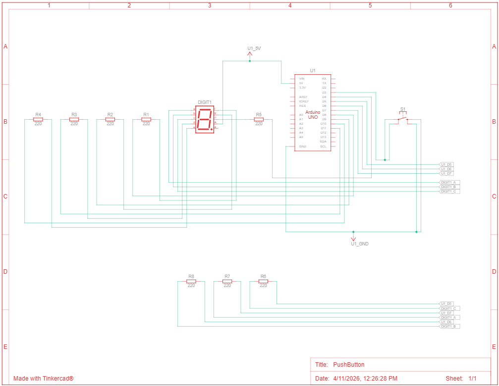

# Praktikum Push Button dengan Seven Segment Display

1. Gambarkan rangkaian schematic yang digunakan pada percobaan!
2. Mengapa pada push button digunakan mode INPUT_PULLUP pada Arduino Uno? Apa keuntungannya dibandingkan rangkaian biasa?
3. Jika salah satu LED segmen tidak menyala, apa saja kemungkinan penyebabnya dari sisi hardware maupun software?
4. Modifikasi rangkaian dan program dengan dua push button yang berfungsi sebagai penambahan (increment) dan pengurangan (decrement) pada sistem counter dan berikan penjelasan disetiap baris kode nya dalam bentuk README.md!

---

## Jawaban Pertanyaan

### 1. Rangkaian Schematic Push Button dengan Seven Segment Display



---

### 2. Mengapa Menggunakan INPUT_PULLUP?

Push button menggunakan mode:

```cpp
pinMode(btnUp, INPUT_PULLUP);
```

Artinya Arduino mengaktifkan **resistor pull-up internal** sehingga:

* Saat tombol **tidak ditekan** → nilai HIGH
* Saat tombol **ditekan** → nilai LOW (terhubung ke GND)

**Keuntungan menggunakan INPUT_PULLUP:**

* Tidak perlu resistor eksternal
* Rangkaian lebih sederhana
* Mengurangi noise (lebih stabil)
* Menghindari kondisi floating input
* Wiring lebih sedikit

**Perbandingan:**

**Tanpa INPUT_PULLUP:**
* Perlu resistor 10K eksternal
* Wiring lebih banyak
* Lebih mudah terjadi pembacaan tidak stabil

**Dengan INPUT_PULLUP:**
* Tidak perlu resistor tambahan
* Langsung stabil
* Wiring lebih sederhana

---

### 3. Jika Salah Satu Segmen LED Tidak Menyala

Kemungkinan dari sisi **Hardware**:

1. Kabel tidak terhubung dengan benar
2. Pin Arduino salah koneksi
3. Resistor putus atau tidak terpasang
4. LED segmen rusak
5. Salah tipe (Common Anode / Common Cathode)
6. Ground / VCC tidak terhubung
7. Pin Arduino rusak

Kemungkinan dari sisi **Software**:

1. Mapping pin salah

```cpp
const int segmentPins[8] = {...}
```

2. Pola digit salah

```cpp
digitPattern
```

3. Tidak menggunakan negasi (!)

```cpp
digitalWrite(segmentPins[i], !digitPattern[num][i]);
```

4. Index array salah

5. Pin belum diset OUTPUT

```cpp
pinMode(segmentPins[i], OUTPUT);
```

---

---

## 4. Program Modifikasi: Push Button Increment & Decrement

### Kode Program

```cpp
#include <Arduino.h>

// =================== PIN ==================
const int segmentPins[8] = {7, 6, 5 ,11, 10, 8, 9, 4};
// a b c d e f g dp

const int btnUp = 3;
const int btnDown = 2;

// ================= DATA =================
byte digitPattern[16][8] = {

{1,1,1,1,1,1,0,0}, //0
{0,1,1,0,0,0,0,0}, //1
{1,1,0,1,1,0,1,0}, //2
{1,1,1,1,0,0,1,0}, //3
{0,1,1,0,0,1,1,0}, //4
{1,0,1,1,0,1,1,0}, //5
{1,0,1,1,1,1,1,0}, //6
{1,1,1,0,0,0,0,0}, //7
{1,1,1,1,1,1,1,0}, //8
{1,1,1,1,0,1,1,0}, //9
{1,1,1,0,1,1,1,0}, //A
{0,0,1,1,1,1,1,0}, //b
{1,0,0,1,1,1,0,0}, //C
{0,1,1,1,1,0,1,0}, //d
{1,0,0,1,1,1,1,0}, //E
{1,0,0,0,1,1,1,0}  //F
};

int currentDigit = 0;

bool lastUpState = HIGH;
bool lastDownState = HIGH;

// ============= FUNCTION ============
void displayDigit(int num)
{
  for(int i=0;i<8;i++)
  {
    digitalWrite(segmentPins[i], !digitPattern[num][i]);
  }
}

// ================= SETUP ============
void setup()
{
  for(int i=0;i<8;i++)
  {
    pinMode(segmentPins[i], OUTPUT);
  }

  pinMode(btnUp, INPUT_PULLUP);
  pinMode(btnDown, INPUT_PULLUP);

  displayDigit(currentDigit);
}

// ================= LOOP ============
void loop()
{
  bool upState = digitalRead(btnUp);
  bool downState = digitalRead(btnDown);

  // tombol UP
  if(lastUpState == HIGH && upState == LOW)
  {
    currentDigit++;
    if(currentDigit > 15) currentDigit = 0;
    displayDigit(currentDigit);
  }

  // tombol DOWN
  if(lastDownState == HIGH && downState == LOW)
  {
    currentDigit--;
    if(currentDigit < 0) currentDigit = 15;
    displayDigit(currentDigit);
  }

  lastUpState = upState;
  lastDownState = downState;
}
```

---

## Penjelasan Baris Kode

### Import Library

```cpp
#include <Arduino.h>
```

Memanggil library utama Arduino.

---

### Mapping Pin Seven Segment

```cpp
const int segmentPins[8] = {7, 6, 5 ,11, 10, 8, 9, 4};
```

Menentukan pin Arduino yang terhubung ke segmen a sampai dp.

---

### Pin Push Button

```cpp
const int btnUp = 3;
const int btnDown = 2;
```

Menentukan pin tombol UP dan DOWN.

---

### Data Pola Seven Segment

```cpp
byte digitPattern[16][8]
```

Menyimpan pola angka 0 sampai F.

---

### Variabel Counter

```cpp
int currentDigit = 0;
```

Menyimpan angka yang sedang ditampilkan.

---

### State Tombol

```cpp
bool lastUpState = HIGH;
bool lastDownState = HIGH;
```

Digunakan untuk mendeteksi perubahan tombol (edge detection).

---

### Fungsi Display

```cpp
void displayDigit(int num)
```

Menampilkan angka ke seven segment.

```cpp
digitalWrite(segmentPins[i], !digitPattern[num][i]);
```

Mengirim data ke setiap segmen.

---

### Setup

```cpp
pinMode(segmentPins[i], OUTPUT);
```

Mengatur semua pin seven segment sebagai output.

```cpp
pinMode(btnUp, INPUT_PULLUP);
pinMode(btnDown, INPUT_PULLUP);
```

Mengaktifkan pullup internal pada tombol.

---

### Loop

```cpp
bool upState = digitalRead(btnUp);
```

Membaca tombol UP.

```cpp
bool downState = digitalRead(btnDown);
```

Membaca tombol DOWN.

---

### Tombol UP

```cpp
if(lastUpState == HIGH && upState == LOW)
```

Mendeteksi tombol ditekan.

```cpp
currentDigit++;
```

Menambah nilai.

```cpp
if(currentDigit > 15) currentDigit = 0;
```

Kembali ke 0 setelah F.

---

### Tombol DOWN

```cpp
if(lastDownState == HIGH && downState == LOW)
```

Deteksi tombol turun.

```cpp
currentDigit--;
```

Mengurangi nilai.

```cpp
if(currentDigit < 0) currentDigit = 15;
```

Jika kurang dari 0 kembali ke F.

---

### Update State

```cpp
lastUpState = upState;
lastDownState = downState;
```

Menyimpan kondisi tombol sebelumnya.

---

## Cara Kerja

**Tombol UP ditekan:**

```
0 → 1 → 2 → ... → F → 0
```

**Tombol DOWN ditekan:**

```
0 → F → E → D → ... → 0
```

