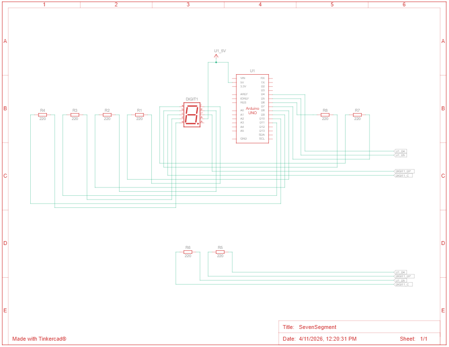

# Praktikum Seven Segment Display

1. Gambarkan rangkaian schematic yang digunakan pada percobaan!
2. Apa yang terjadi jika nilai num lebih dari 15?
3. Apakah program ini menggunakan common cathode atau common anode? Jelaskan alasannya!
4. Modifikasi program agar tampilan berjalan dari F ke 0 dan berikan penjelasan disetiap baris kode nya dalam bentuk README.md!

---

## Jawaban Pertanyaan

### 1. Rangkaian Schematic Seven Segment Display



```
Arduino Pin Connections:
        Pin7 (a)     Pin6 (b)     Pin5 (c)     Pin11 (d)
         |            |            |            |
    ----[R 220Ω]- |a| ----[R 220Ω]- |b| ----[R 220Ω]- |c| ----[R 220Ω]- |d|
         |        |   |     |        |   |     |        |   |     |        |   |
         |        |___|     |        |___|     |        |___|     |        |___|
         |         / \      |         / \      |         / \      |         / \
         |        /   \     |        /   \     |        /   \     |        /   \
         |       |     |    |       |     |    |       |     |    |       |     |
         |       | LED |    |       | LED |    |       | LED |    |       | LED |
         |       |     |    |       |     |    |       |     |    |       |     |
         |        \   /     |        \   /     |        \   /     |        \   /
         |         \ /      |         \ /      |         \ /      |         \ /
         |          |       |          |       |          |       |          |
         +----------+-------+----------+-------+----------+-------+----------+
                              |
                            GND (Common Cathode)


        Pin10 (e)    Pin8 (f)     Pin9 (g)     Pin4 (dp)
         |            |            |            |
    ----[R 220Ω]- |e| ----[R 220Ω]- |f| ----[R 220Ω]- |g| ----[R 220Ω]- |dp|
         |        |   |     |        |   |     |        |   |     |        |   |
         |        |___|     |        |___|     |        |___|     |        |___|
         |         / \      |         / \      |         / \      |         / \
         |        /   \     |        /   \     |        /   \     |        /   \
         |       |     |    |       |     |    |       |     |    |       |     |
         |       | LED |    |       | LED |    |       | LED |    |       | LED |
         |       |     |    |       |     |    |       |     |    |       |     |
         |        \   /     |        \   /     |        \   /     |        \   /
         |         \ /      |         \ /      |         \ /      |         \ /
         |          |       |          |       |          |       |          |
         +----------+-------+----------+-------+----------+-------+----------+
                              |
                            GND (Common Cathode)

Keterangan:
- Seven Segment Display menggunakan Common Cathode (semua katoda terhubung ke GND)
- Setiap segmen memiliki resistor pembatas arus 220 Ohm
- Pin Arduino: 7, 6, 5, 11, 10, 8, 9, 4 untuk segment a-g dan dp
- Setiap PIN Arduino mengirim sinyal HIGH untuk menyalakan segment
```

---

### 2. Apa yang Terjadi Jika nilai num Lebih dari 15?

**Jawaban:**

Jika nilai `num` lebih dari 15, program akan membaca indeks array di luar batas `digitPattern`. Array tersebut hanya tersedia dari indeks 0 sampai 15. Jadi kalau `num = 16`, program mencoba mengakses `digitPattern[16]` yang sebenarnya tidak ada.

**Akibatnya:**
- Seven segment bisa menampilkan pola yang aneh atau acak
- Program bisa hang atau tidak stabil
- Beberapa segmen LED bisa menyala tidak sesuai

**Penyelesaian / Best Practice:**

Supaya aman, sebaiknya tambahkan validasi nilai sebelum ditampilkan:

```cpp
void displayDigit(int num)
{
  if (num >= 0 && num <= 15)
  {
    for(int i=0;i<8;i++)
    {
      digitalWrite(segmentPins[i], !digitPattern[num][i]);
    }
  }
  else
  {
    // indikator error
    for(int i=0;i<8;i++)
    {
      digitalWrite(segmentPins[i], HIGH);
    }
  }
}
```

Dengan validasi ini, program tidak akan membaca array di luar batas.

---

### 3. Apakah Program Menggunakan Common Cathode atau Common Anode?

**Jawaban: Program Menggunakan COMMON ANODE**

**Alasannya bisa dilihat dari baris kode berikut:**

```cpp
digitalWrite(segmentPins[i], !digitPattern[num][i]);
```

Di sini nilai pattern dibalik menggunakan tanda `!`. Artinya:

- Jika `digitPattern = 1` → dikirim `LOW` → segmen menyala
- Jika `digitPattern = 0` → dikirim `HIGH` → segmen mati

**Logika LOW = menyala adalah ciri dari Common Anode.**

**Kesimpulannya:**

| Karakteristik | Nilai |
|---|---|
| Output LOW menyalakan LED | ✓ |
| Output HIGH mematikan LED | ✓ |
| Program memakai negasi `!` | ✓ |
| Semua menunjukkan Common Anode | **✓** |

Jadi seven segment yang digunakan adalah **Common Anode**

---

## 4. Program Modifikasi: Menampilkan dari F ke 0

Program yang dimodifikasi agar menampilkan urutan dari F (15) ke 0:

```cpp
#include <Arduino.h>

// 7-Segment Display (Efficient Version)
// Display F - 0

// Pin mapping segment
const int segmentPins[8] = {7, 6, 5, 11, 10, 8, 9, 4};
// a b c d e f g dp

// Segment pattern untuk 0 - F
// urutan segmen: a b c d e f g dp
byte digitPattern[16][8] = {

{1,1,1,1,1,1,0,0}, //0
{0,1,1,0,0,0,0,0}, //1
{1,1,0,1,1,0,1,0}, //2
{1,1,1,1,0,0,1,0}, //3
{0,1,1,0,0,1,1,0}, //4
{1,0,1,1,0,1,1,0}, //5
{1,0,1,1,1,1,1,0}, //6
{1,1,1,0,0,0,0,0}, //7
{1,1,1,1,1,1,1,0}, //8
{1,1,1,1,0,1,1,0}, //9
{1,1,1,0,1,1,1,0}, //A
{0,0,1,1,1,1,1,0}, //b
{1,0,0,1,1,1,0,0}, //C
{0,1,1,1,1,0,1,0}, //d
{1,0,0,1,1,1,1,0}, //E
{1,0,0,0,1,1,1,0}  //F
};

// Fungsi menampilkan digit
void displayDigit(int num)
{
  for(int i=0;i<8;i++)
  {
    digitalWrite(segmentPins[i], !digitPattern[num][i]);
  }
}

void setup()
{
  for(int i=0;i<8;i++)
  {
    pinMode(segmentPins[i], OUTPUT);
  }
}

void loop()
{
  for(int i=15;i>=0;i--)
  {
    displayDigit(i);
    delay(1000);
  }
}
```

---

## Penjelasan Setiap Baris Kode

### Library

```cpp
#include <Arduino.h>
```

Digunakan untuk memanggil library utama Arduino agar fungsi seperti `pinMode`, `digitalWrite`, dan `delay` bisa digunakan.

---

### Mapping Pin Seven Segment

```cpp
const int segmentPins[8] = {7, 6, 5, 11, 10, 8, 9, 4};
```

Array ini berisi pin Arduino yang terhubung ke seven segment.

Urutan pin:

```
a b c d e f g dp
```

Artinya:

* a → pin 7
* b → pin 6
* c → pin 5
* d → pin 11
* e → pin 10
* f → pin 8
* g → pin 9
* dp → pin 4

---

### Pola Digit 0 - F

```cpp
byte digitPattern[16][8]
```

Array 2 dimensi yang berisi pola nyala LED untuk angka **0 sampai F**.

Contoh:

```cpp
{1,1,1,1,1,1,0,0}, //0
```

Artinya:

* segmen a-f menyala
* segmen g mati
* dp mati

Nilai:

* 1 = segmen ON
* 0 = segmen OFF

---

### Fungsi Menampilkan Digit

```cpp
void displayDigit(int num)
```

Fungsi ini digunakan untuk menampilkan angka ke seven segment.

```cpp
for(int i=0;i<8;i++)
```

Loop untuk mengakses semua segmen (a sampai dp).

```cpp
digitalWrite(segmentPins[i], !digitPattern[num][i]);
```

Menyalakan atau mematikan segmen sesuai pola digit.

Tanda `!` digunakan karena seven segment menggunakan **Common Anode**.

---

### Setup

```cpp
void setup()
```

Fungsi ini dijalankan sekali saat Arduino dinyalakan.

```cpp
for(int i=0;i<8;i++)
```

Loop untuk semua pin segmen.

```cpp
pinMode(segmentPins[i], OUTPUT);
```

Mengatur semua pin seven segment sebagai output.

---

### Loop Utama (F ke 0)

```cpp
void loop()
```

Fungsi yang berjalan terus menerus.

```cpp
for(int i=15;i>=0;i--)
```

Loop mundur dari:

* 15 → F
* 14 → E
* 13 → d
* ...
* 0 → 0

Ini yang membuat tampilan berjalan dari **F ke 0**.

```cpp
displayDigit(i);
```

Menampilkan angka sesuai nilai i.

```cpp
delay(1000);
```

Memberi jeda 1 detik sebelum pindah ke angka berikutnya.

---

### Hasil Tampilan

Urutan yang tampil di seven segment:

```
F → E → d → C → b → A → 9 → 8 → 7 → 6 → 5 → 4 → 3 → 2 → 1 → 0
```

Kemudian mengulang lagi dari F.
